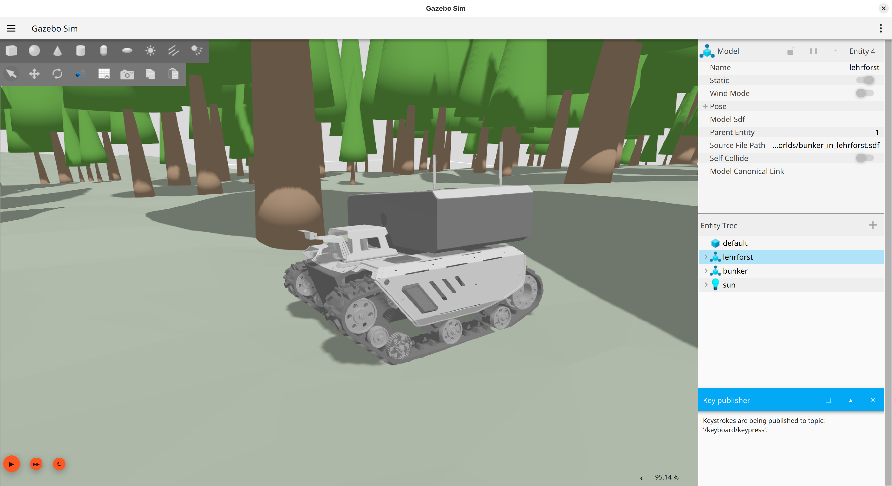
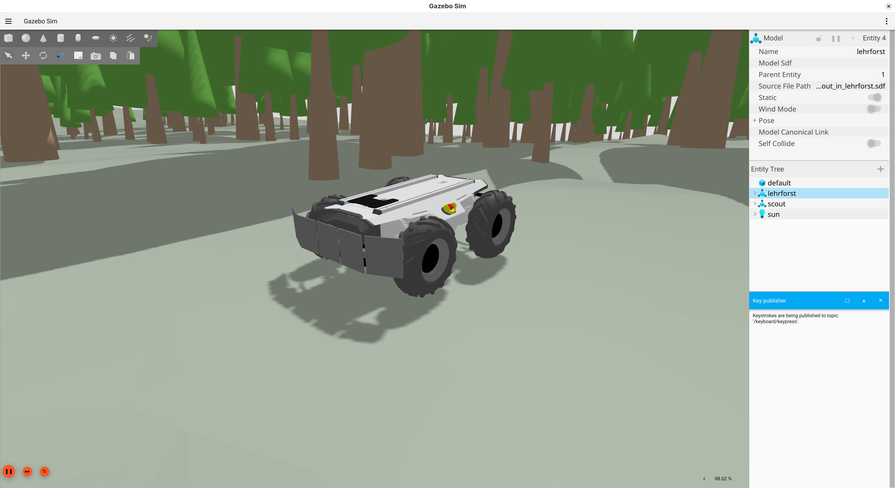

# ROS2 Gazebo Simulation for our Robots

#### AgileX Bunker


#### AgileX Scout



## Requirements

- [ROS2 jazzy](https://docs.ros.org/en/jazzy/Installation.html)
- [Gazebo](https://gazebosim.org/docs/harmonic/ros_installation/)


## Installation

Create directory
```bash
mkdir -p ros_gz_sim/src
cd ros_gz_sim/src
```

Clone repo
```bash
git clone https://github.com/hcai-lab-vienna/ros_gz_sim.git
```

Build
```bash
cd ..
colcon build --symlink-install
```

## Simulation

Start with
```bash
source install/setup.bash
ros2 launch ros_gz_sim bunker_lehrforst.launch.xml # Bunker
ros2 launch ros_gz_sim scout_lehrforst.launch.xml # Bunker
```

After starting simulation control with arrow keys (press 's' for break) inside Gazebo or via ros with
```bash
ros2 run teleop_twist_keyboard teleop_twist_keyboard
```

Alternatively you can publish to `/cmd_vel` for control commands.

Other ROS2 topics besides `\odom`, `\pose`, `\tf`, `\imu`:
- For scout exists `/scout/force_bar/segment_X` where `X` is `0` to `4`, the wrench data from force bar segments.
